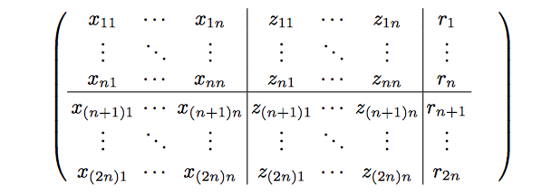
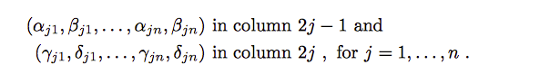

# Juqst: JUlia Quantum Simulator Toolbox
# To install

It should be a matter of simply using the package manager.

This has not yet been put on the main public distribution, so you will need to point to the registry:

```julia
pkg> add https://github.com/rharper2/Juqst.jl
```

The exampleNotebooks directory contains, suprisingly enough, some sample notebooks that show how to work this. They assume IJulia. The one that shows how to use the Stabiliser mechanisms and plotting functions is called "A stabiliser run through". It is probably worth running that one early.

This readme mainly details the CHP part of the programs included, there is documentation on the other functionality which can be found here: https://rharper2.github.io/Juqst.jl/docs/build/index.html

Below is a introduction to the CHP part of the package.

```julia
    Tableau(n::Integer)
```


 sets up and returns the a CHP Tableau for n qubits.

 This is based on the formalism given by: *Improved Simulation of Stabilizer Circuits*,
 Scott Aaronson and Daniel Gottesman, arXiv:quant-ph/0406196v5

 The initial tableau represents a |00...0$\rangle$ ket in the stabiliser state
 This stabilises with "Z" and anti-stabilises with "X"

 For the purposes of this port, the tableau is exactly replicated as per the paper
 i.e. the "state" (Tableau.state) is an Int32 array (used as a bit array)
 containing the following information.

```
 x11   .....  x1n  | z11   ...       z1n | r1
  .    \\       .  |  .    \\          . |  .
  .     \\      .  |  .     \\         . |  .     Destabilisers
  .      \\     .  |  .      \\        . |  .
 xn1      \\   xnn | zn1      \\      znn| rn
 ______________________________________________
 x(n+1)1. x(n+1)n  | z(n+1) ... z(n+1)n  | r(n+1)
  .    \\       .  |  .      \\        . |  .
  .     \\      .  |  .       \\       . |  .     Stabilisers
  .      \\     .  |  .        \\      . |  .
 x(2n)1   \\x(2n)n | z(2n)1     \\ z(2n)n| r(2n)
```
Set Tableau.showRaw to true to see the underlying state as a matrix.

# Sample use

## Stabiliser Circuits

```Julia
state = setup(number_ofQubits)
```

prepares the stabiliser state for the correct number of qubits in the |000..000> basis state

The state is represented internally as a matrix of the form:

</img>

[Aaronson/Gottesman arXiv:quant-ph/0406196](https://arxiv.org/abs/quant-ph/0406196)

Currently I am just using Int32 Arrays, although binary arrays would save space (if it ever becomes necessary).
Rows 1 to n of the tableau represent the destabiliser generators, rows n+1 to 2n represent the stabiliser generators. Each row is read
as follows: if the x<sub>ij</sub> and z<sub>ij</sub> are 1, the de/stabiliser is a Y, if they are both 0, its I otherwise its an X or Z depending on which one is set.

```julia
output(state)
```

Prints the state in a human readable form. The states above the line are the 'destabiliser' state, below the line are the 'stabiliser' states. 

So in a 3 qubit system the initial state of |000> is coded as 

```
XII
IXI
IIX
---
ZII
IZI
IIZ
```

The following commands are defined

```JULIA
hadamard(t::Tableau,qubit)  # apply a hadamard to the relevant qubit
phase(t::Tableau,qubit)     # apply a phase gate to the relevant qubit
cnot(t::Tableau,control,target) # apply a controlled not from control qubit to target qubit
```

Output of the resultant state can be supressed by adding an extra false parameter

```julia
hadamard(t::Tableau,qubit,true) # hadamard as before, but show output
```

**NOTE! that these commands alter the state passed into them. I have broken Julia convention which requires functions 
with side effects to be written thus - hadamard!(state,qubit), rather hadamard!(qubit) alters a globally defined variable, called state.**

## Arbitrary cliffords

[Koenig/Smolin arXiv:quant-ph/1406.2170](https://arxiv.org/abs/1406.2170)

The idea behind this paper is that we can implement a one-to-one mapping between the cliffords and an integer (plus a random phase string).

The mapping is as follows:

Koenig/Smolin arXiv:quant-ph/1406.2170</img>

We can generate the alpha,beta,gamma and delta via

   symplectic(i,n) # i = integer represting the clifford, n is the number of qubits

Which returns the nxn arrays (alpha->delta) coded as follows:

Koenig/Smolin arXiv:quant-ph/1406.2170</img>

More usefully these can be placed into a stabiliser tableau (that is the equivlent of passing the state |0000$\rangle$ through a gate that implements the unitary in question as follows:

e.g.

```julia
t = cliffordToTableau(4,23,1)
```

Where the qubits are 4 the Clifford chosen is 23, and we have chosen the first of $4^n$ phase patterns (here n = 4).

# Decomposing a tableau 

This will be made more general, but just now it decomposes an arbitrary tableau. This is not particulary efficient.

```julia
decompose(tableau)
```

This prints out the elementary gates that would reconstruct the relevant clifford unitary. There is an optional parameter rationalise that defaults to true. Rationalise simply eliminates 4 phases in a row, two hadamards in a row or self cancelling cnots.

The commands are stored as string in the vector commands


# Draw the circuit

This is a bit more involved, just now as it uses python packages. There should be an example in the notebooks. More details to be added.


